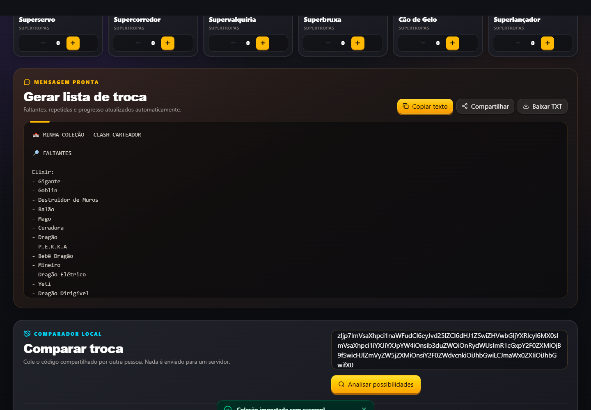
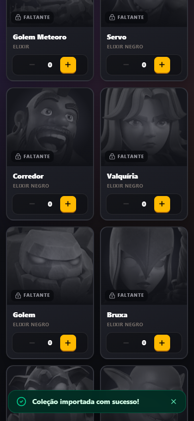

# Clash of Card Tracker


Álbum digital para acompanhar as 60 cartas do evento Clash Carteador, controlar repetidas, encontrar cartas faltantes e descobrir possibilidades de troca com outros jogadores.

> **English:** A bilingual collection tracker for the Clash Carteador event, with account synchronization, public player profiles and trade comparison.

## Capturas

### Coleção no desktop



### Coleção no mobile



As capturas usam apenas dados locais de demonstração e não exibem credenciais ou informações pessoais.

## Funcionalidades

- Catálogo definitivo com 60 cartas em quatro categorias: Elixir, Elixir Negro, Base do Construtor e Supertropas.
- Controle de cartas obtidas, faltantes e quantidades repetidas.
- Progresso geral e por categoria.
- Busca bilíngue em português e inglês, sem diferença entre maiúsculas, minúsculas ou acentos.
- Filtros por categoria e estado da carta.
- Geração, cópia, compartilhamento e download da lista de troca.
- Exportação e importação em JSON e código compacto `CCT2`.
- Compatibilidade de leitura e migração para backups antigos `CCT1`.
- Modo sem conta com persistência automática no navegador.
- Cadastro, login, logout e recuperação de senha.
- Sincronização da coleção entre dispositivos usando Supabase.
- Perfil público com nome, nick, tag do jogador, clã, tag do clã, bio e avatar predefinido.
- Comunidade pública com pesquisa, paginação e métricas de coleção.
- Comparação entre coleções e cálculo de oportunidades de troca nos dois sentidos.
- Interface responsiva em desktop, tablet e mobile.
- Interface completa em Português do Brasil e inglês.
- Metadados Open Graph e Twitter Card para previews de compartilhamento.

## Modos de uso

### Sem conta

No modo visitante, a coleção é salva em `localStorage` e permanece limitada ao navegador e dispositivo atuais. Ela não é sincronizada entre dispositivos e o visitante não aparece na comunidade.

Exportação, importação, busca, filtros, controle de repetidas, comparação local e geração da lista de troca continuam disponíveis.

### Com conta

Com autenticação habilitada, o Supabase é a fonte remota da coleção e do perfil. O navegador mantém um cache local resiliente, enquanto alterações são sincronizadas para permitir o uso da mesma coleção no PC e no celular.

Usuários autenticados criam um perfil público, escolhem um avatar e podem comparar sua coleção com outros jogadores da comunidade. Escritas remotas sempre usam o usuário obtido pela sessão atual.

## Tecnologias

- React 19
- TypeScript
- Vite
- Tailwind CSS
- Supabase
- React Router
- i18next e react-i18next

## Executar localmente

Requisitos: Node.js 20.19+ ou 22.12+ e npm.

```bash
git clone https://github.com/joaopedrobn/tracker-clashofcards.git
cd tracker-clashofcards
npm install
```

No PowerShell, crie a configuração local e inicie o projeto:

```powershell
Copy-Item .env.example .env.local
npm run dev
```

O Vite exibirá o endereço local, normalmente `http://localhost:5173`.

## Variáveis de ambiente

```dotenv
VITE_SUPABASE_URL=
VITE_SUPABASE_PUBLISHABLE_KEY=
VITE_PUBLIC_SITE_URL=
```

- `VITE_SUPABASE_URL`: URL pública do projeto Supabase.
- `VITE_SUPABASE_PUBLISHABLE_KEY`: chave publicável/anon destinada ao frontend.
- `VITE_PUBLIC_SITE_URL`: origem pública do site, sem barra final, usada nas metatags sociais.

O arquivo `.env.local` é ignorado pelo Git. Configure as mesmas variáveis na plataforma de hospedagem e nunca use `service_role`, senha do banco ou outra chave secreta no frontend.

Sem as variáveis do Supabase, o modo local continua funcionando e os recursos de conta ficam desabilitados.

## Scripts disponíveis

| Comando                    | Finalidade                                                    |
| -------------------------- | ------------------------------------------------------------- |
| `npm run dev`              | Inicia o servidor de desenvolvimento.                         |
| `npm run lint`             | Executa o ESLint.                                             |
| `npm run validate:cards`   | Valida catálogo, IDs e as 60 imagens das cartas.              |
| `npm run validate:sync`    | Valida migração, mesclagem, perfil e regras de sincronização. |
| `npm run validate:i18n`    | Confere a paridade das traduções PT-BR e EN.                  |
| `npm run validate:avatars` | Valida arquivos, catálogo e segurança dos avatares.           |
| `npm run build`            | Executa o TypeScript e gera o build otimizado.                |
| `npm run preview`          | Serve localmente o build de produção.                         |
| `npm run test:smoke`       | Executa o smoke test em Chrome contra um preview local.       |

## Banco de dados e segurança

O projeto utiliza duas tabelas principais:

- `profiles`: dados públicos do jogador, incluindo `avatar_url` e data da última atualização da coleção.
- `user_cards`: IDs das cartas, estado de obtenção e quantidade de repetidas por usuário.

O catálogo, traduções e imagens permanecem no frontend. O banco armazena somente IDs e estados da coleção. As mutações consultam `auth.getUser()` e não aceitam um `user_id` arbitrário vindo da interface.

As políticas RLS devem permitir que cada usuário altere somente suas próprias linhas e que a leitura pública alcance apenas perfis marcados como públicos. Índices recomendados e uma consulta de auditoria estão em [`supabase/recommended-indexes-and-rls.sql`](supabase/recommended-indexes-and-rls.sql).

## Formatos de coleção

- `CCT2`: formato compacto atual usado para compartilhar ou restaurar a coleção.
- `CCT1`: formato antigo aceito somente para compatibilidade e migração.
- JSON: backup legível com versão, cartas e preferências da coleção.

Avatares, dados de conta e perfil não fazem parte dos backups da coleção.

## Avatares de perfil

Os avatares ficam em `public/avatars/` e seguem o padrão `avatar-N.webp`, com número inteiro positivo. O catálogo centralizado em `src/data/avatars.ts` mantém a ordem numérica e aceita apenas caminhos cadastrados como `/avatars/avatar-3.webp`.

URLs externas, base64, caminhos temporários e arquivos locais são rejeitados. Perfis antigos com avatar ausente ou inválido usam um fallback com a inicial do nome.

Para adicionar um avatar:

1. Adicione `public/avatars/avatar-N.webp` usando o próximo número livre.
2. Inclua o registro correspondente em `src/data/avatars.ts`.
3. Execute `npm run validate:avatars`.
4. Execute `npm run build`.

## Compartilhamento social

O `index.html` fornece título, descrição, imagem e demais metadados Open Graph/Twitter Card. O manifest está em `public/site.webmanifest`.

Em produção, configure `VITE_PUBLIC_SITE_URL` com o domínio público antes do build. Isso transforma a referência da imagem em URL absoluta para crawlers como o WhatsApp.

## Estrutura principal

```text
.
├── docs/screenshots/       # Capturas públicas usadas no README
├── public/
│   ├── avatars/            # Avatares predefinidos
│   ├── cards/              # Imagens das 60 cartas
│   ├── logo/               # Favicon e imagens da marca
│   └── site.webmanifest
├── scripts/                # Validações e smoke test
├── src/
│   ├── components/
│   ├── data/
│   ├── hooks/
│   ├── i18n/
│   ├── pages/
│   ├── providers/
│   ├── repositories/
│   ├── services/
│   ├── types/
│   └── utils/
└── supabase/               # SQL recomendado para índices e RLS
```

## Branches

- `main`: desenvolvimento e integração.
- `prod`: versão estável usada para produção.

Fluxo recomendado:

```text
novas alterações → main → validação → prod
```

## Aviso legal

Este é um projeto independente e não oficial. Clash of Clans e seus elementos pertencem à Supercell. Este projeto não é afiliado, patrocinado ou aprovado pela Supercell.

**Legal notice:** This is an independent, unofficial project. Clash of Clans and its assets belong to Supercell. This project is not affiliated with, sponsored by, or endorsed by Supercell.
